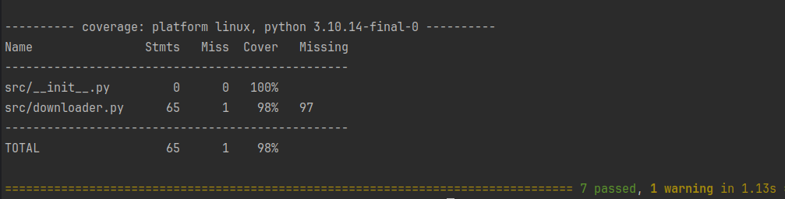

# Repo Downloader

This project contains solutions to a test task focusing on Python asyncio, aiohttp, and pytest.

## Getting Started

To get a local copy up and running follow these simple steps.

### Prerequisites

Make sure you have Python 3.10+ installed. Optionally, use a virtual environment for isolation.

### Installation

1. Clone the repository:
   ```bash
   git clone https://github.com/rojcovictor1/radium_test_task.git
   cd your-repository
   ```

2. Install dependencies
   ```bash 
    pip install -r requirements.txt
   ```

3. Running tests
    ```bash
   pytest --cov=src
   ```
4. Code Quality Check
    ```bash
   flake8 src
    ```

### Test Coverage

This image shows the test coverage of the project, almost reaching 100%.


### Task Description
This project serves as a solution to a test task involving:

Implementing asynchronous file downloading using aiohttp.
Testing with pytest and achieving high test coverage.
Ensuring code quality with Flake8.